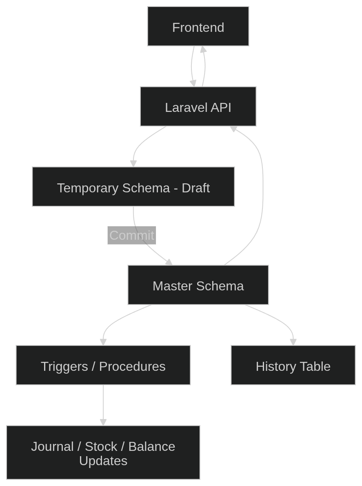
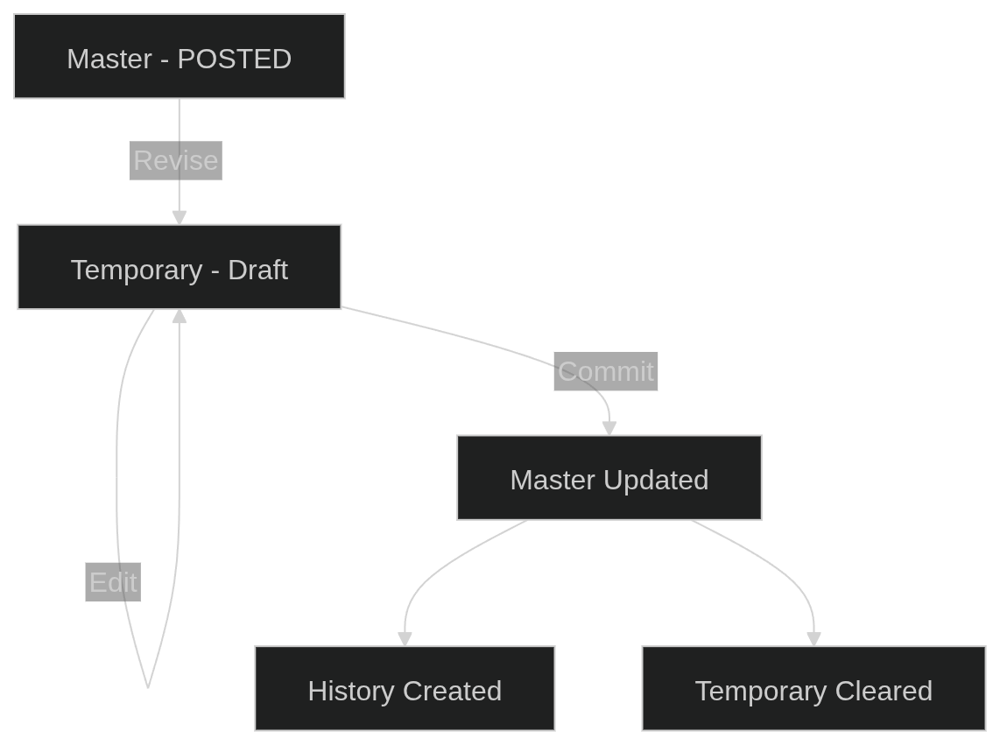
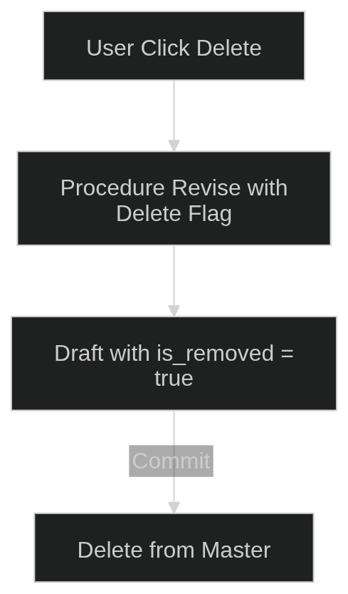
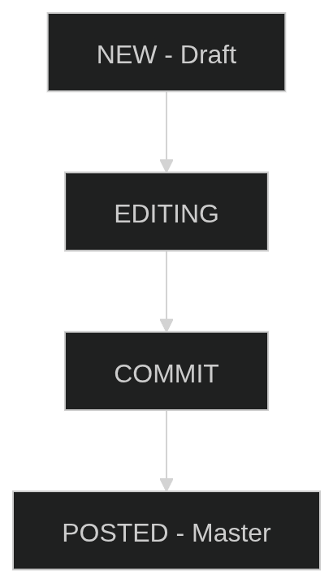

# Change Language

[🇮🇩 Indonesia](README.id.md)

---

# 🚀 ERP Backend – Enterprise Modular Architecture

<p align="center"><a href="https://laravel.com" target="_blank"></a></p>

<p align="center">
<a href="https://github.com/laravel/framework/actions"></a>
<a href="https://packagist.org/packages/laravel/framework"></a>
<a href="https://packagist.org/packages/laravel/framework"></a>
<a href="https://packagist.org/packages/laravel/framework"></a>
</p>

Enterprise-grade modular backend built with Laravel and PostgreSQL using a **Master–Draft Pattern**, Stored Procedures, and database-driven business logic.

---

# 📚 Table of Contents

* [Overview](#-overview)
* [Installation](#-installation)
* [Creating New Modules](#-creating-new-modules)
* [Permission Management](#-permission-management)
* [Architecture](#-architecture)
* [Workflow](#-workflow)
* [API Structure](#-api-structure)
* [Database Flow](#-database-flow)
* [Why This Architecture?](#-why-this-architecture)
* [API Documentation](#-api-documentation)
* [Temporary Hierarchical](#-temporary-schema)

---

# 🧭 Overview

This project is built using a [**Laravel Module**](https://laravelmodules.com/docs/12/advanced/artisan-commands).

Core principles:

* Separation between **Master (Posted Data)** and **Draft (Temporary Workspace)**
* Business logic handled at **database level (Triggers & Stored Procedures)**
* Laravel acts as:

    * Validator
    * Orchestrator
    * API responder

---

# 🚀 Installation

## Requirements

* PHP 8.2+
* Composer
* Laravel 12.x
* PostgreSQL

---

## Setup

Clone repository:

```bash
git clone https://github.com/HKA-web/Backend.Erp.git {project_name}
```

Enter project:

```bash
cd {project_name}
```

Install dependencies:

```bash
composer install --prefer-dist
```

Setup environment:

```bash
cp .env.example .env
```

Generate key:

```bash
php artisan key:generate
```

Run migration:

```bash
php artisan migrate
```

Run seed default:

```bash
php artisan module:seed Authentication
php artisan module:seed Core
```

Run server:

```bash
php artisan serve
```

---

# 🛠 Creating New Modules

Create module:

```bash
php artisan erp:make-module {module}
```

Create model:

```bash
php artisan erp:make-model {model} {module}
```

Run module migration:

```bash
php artisan module:migrate {module}
```

Run seed the database:

```bash
php artisan module:seed {module}
```

---

# 🔐 Permission Management

This project uses [**Spatie Laravel Permission**.](https://spatie.be/docs/laravel-permission/v7/introduction)

Example:

```php
$user->assignRole('admin');
$role->givePermissionTo('edit-user');
```

---

# 🏗 Architecture

## Master–Draft Pattern + remoteForeign Support

* ✅ Master & Draft schema separation
* ✅ Cross-schema relationship using `remoteForeign`
* ✅ All Master modifications via Stored Procedures
* ✅ Audit-friendly & workflow-ready

---

## 🧩 High-Level Architecture Diagram



---

# 🔄 Workflow

## API Endpoint Example

`POST /store`

### Laravel Responsibilities

* Validate input
* Store validated data into temporary table
* Execute stored procedure:

```sql
CALL core.procedure_commit();
```

---

## Database Responsibilities

When an `INSERT` or status update occurs:

Trigger automatically executes:

> "New data detected → calculate balance → create journal → update stock."

---

## Final Flow

1. Database returns **OK**
2. Laravel returns JSON success response

---

# 📦 Example Module

Example generated module:

* Module: `Core`
* Model: `Dictionary`
* Master Table: `core.dictionary`
* Temporary Table: `temporary.core_dictionary`

---

# 🏛 API Structure

---

## 1️⃣ Master Resource (Official / Posted Data)

🔒 No direct edits allowed.

| Method | Endpoint                          | Description          |
| ------ |-----------------------------------| -------------------- |
| GET    | `/v1/core/dictionary`             | List POSTED data     |
| GET    | `/v1/core/dictionary/{id}`        | View official detail |
| POST   | `/v1/core/dictionary/{id}/revise` | Lock & copy to Draft |
| DELETE | `/v1/core/dictionary/{id}`        | Request deletion     |

---

## 2️⃣ Draft Resource (Workspace / Sandbox)

| Method | Endpoint                                 | Description   |
| ------ |------------------------------------------| ------------- |
| GET    | `/v1/core/dictionary-drafts`             | List drafts   |
| POST   | `/v1/core/dictionary-drafts`             | Create draft  |
| GET    | `/v1/core/dictionary-drafts/{id}`        | Draft detail  |
| PUT    | `/v1/core/dictionary-drafts/{id}`        | Update draft  |
| DELETE | `/v1/core/dictionary-drafts/{id}`        | Discard draft |
| POST   | `/v1/core/dictionary-drafts/{id}/commit` | Finalize      |

---

# 🧠 Database Flow

## ✏️ Edit Flow



---

## 🗑 Delete Flow



---

# 🎯 Why This Architecture?

* ✅ Zero direct edits to Master
* ✅ Fully auditable
* ✅ Supports approval workflow
* ✅ Multi-user safe
* ✅ Database-driven business rules
* ✅ No redeploy needed for business logic changes

---

# 💼 Real Enterprise Advantage

If your manager says:

> “Every time we save a Village, automatically create a Region record.”

You DO NOT need to:

* Modify Controller
* Change Service layer
* Redeploy the app

You ONLY:

1. Open pgAdmin
2. Modify Trigger or Procedure
3. Done.

---

# 📄 API Documentation

Import Postman collection from:

```
postman/collections/Laravel.postman_collection.json
```

---

# 🏁 Status Lifecycle



---

# 🗂 Temporary Schema

Below is an example of the final column schema design for a **3-Level Master–Detail–SubDetail** structure inside the `temporary` schema.

This structure supports:

* Multi-level hierarchy

---

# 🏗 Hierarchical Structure (3 Levels)

Assume we have:

| Level   | Master Schema Table |
| ------- | ------------------- |
| Level 1 | `sales.orders`      |
| Level 2 | `sales.items`       |
| Level 3 | `sales.item_taxes`  |

The temporary schema mirrors this structure with additional control columns.

---

# 🥇 Level 1 — `temporary.sales_orders`

Root / Master level.

| Column           | Type    | Description                                              |
| ---------------- | ------- | -------------------------------------------------------- |
| `temporary_id`        | uuid    | Primary key for temporary table                          |
| `session_id`     | uuid    | User session ID (login/browser session)                  |
| `master_id`      | string  | Reference to original `order_id` (NULL if new data)      |
| `parent_temporary_id` | uuid    | NULL (root level)                                        |
| `temporary_option`        | char(1) | Operation flag: `I` (Insert), `U` (Update), `D` (Delete) |
| `order_date`     | date    | Original master column                                   |
| `customer_id`    | string  | Original master column                                   |

---

# 🥈 Level 2 — `temporary.sales_order_items`

Detail level linked to `sales_orders`.

| Column           | Type    | Description                                       |
| ---------------- | ------- | ------------------------------------------------- |
| `temporary_id`        | uuid    | Primary key                                       |
| `session_id`     | uuid    | Same as Level 1                                   |
| `master_id`      | string  | Reference to original `item_id` (NULL if new row) |
| `parent_temporary_id` | uuid    | Links to `sales_orders.temporary_id`                   |
| `temporary_option`        | char(1) | Operation flag for this row                       |
| `product_id`     | string  | Original column                                   |
| `qty`            | numeric | Original column                                   |

---

# 🥉 Level 3 — `temporary.sales_order_item_taxes`

Sub-detail level linked to order items.

| Column           | Type    | Description                          |
| ---------------- | ------- | ------------------------------------ |
| `temporary_id`        | uuid    | Primary key                          |
| `session_id`     | uuid    | Same as Level 1 & 2                  |
| `master_id`      | string  | Reference to original `tax_id`       |
| `parent_temporary_id` | uuid    | Links to `sales_order_items.temporary_id` |
| `temporary_option`        | char(1) | Operation flag                       |
| `tax_percent`    | numeric | Original column                      |

---

# 🔗 Relationship Flow

```text
temporary.sales_orders (Level 1)
        │
        └── parent_temporary_id
              ↓
temporary.sales_order_items (Level 2)
        │
        └── parent_temporary_id
              ↓
temporary.sales_order_item_taxes (Level 3)
```

---

# 🧠 Core Design Principles

### 1️⃣ `temporary_id`

Unique identifier inside temporary schema.

### 2️⃣ `session_id`

Ensures data isolation between users.

### 3️⃣ `master_id`

Links to original Master table record.

* NULL → New record
* NOT NULL → Existing record (Update/Delete)

### 4️⃣ `parent_temporary_id`

Maintains hierarchical structure inside temporary schema.

### 5️⃣ `temporary_option`

Tracks operation type:

| Value | Meaning |
| ----- | ------- |
| `I`   | Insert  |
| `U`   | Update  |
| `D`   | Delete  |

---

# 🏢 Designed For

* ERP Systems
* Enterprise Applications
* Audit-sensitive environments
* Multi-user transactional systems

---
